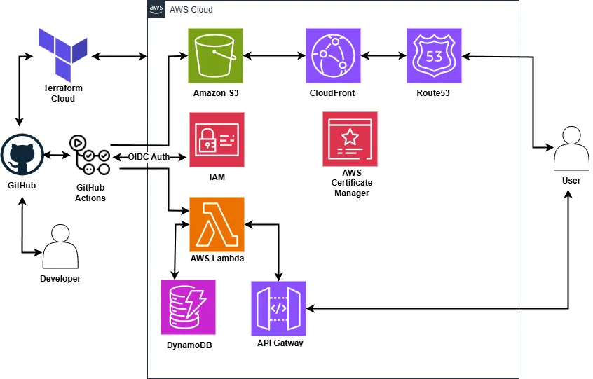

#  Cloud Resume Challenge Rust  (Backend)

This repository contains the backend API implementation for the Cloud Resume Challenge, built using Rust and deployed as serverless functions on AWS. It handles serving resume data and managing the visitor counter.


## ✨ Key Features:

* **Serverless API:** Implemented using Rust and deployed as AWS Lambda functions for scalability and cost-effectiveness.
* **Resume Data Retrieval:** Provides an API endpoint to serve your resume information.
* **Visitor Counter:** Implements functionality to track and retrieve the number of visitors to your resume.
* **Cloud Infrastructure as Code (IaC):** Infrastructure is provisioned and managed using Terraform, demonstrating infrastructure automation skills.
* **Automated CI/CD:** Utilizes GitHub Actions for continuous integration and continuous deployment, ensuring code quality and automated deployments.
* **Security Scanning:** Includes automated security scanning as part of the CI/CD pipeline.
* **Integration Tests:** Contains integration tests to verify the functionality of the visitor counter API endpoints.

## 💻 Technologies Used:

- **Backend:** Rust
- **Cloud Provider:** Amazon Web Services (AWS)
- **Serverless Compute:** AWS Lambda
- **API Gateway:** AWS API Gateway
- **Database:** AWS DynamoDB (for storing visitor count)
- **Infrastructure as Code:** Terraform
- **Continuous Integration/Continuous Deployment (CI/CD):** GitHub Actions
- **Testing:** Cargo

## ⚠️ Requirements:

- **[Rust](https://www.rust-lang.org/)** Version 1.84 or higher.
- **[Cargo Lambda](https://www.cargo-lambda.info/)** A tool for building and deploying Rust functions on AWS Lambda
- **[MSYS2](https://www.msys2.org/)** This project uses ARM64-based Lambdas, which requires MSYS2 to provide libraries for cross-compilation on  Windows based machines.  Ensure that the MSYS2 `bin` directory is in your system's PATH.
- **[Terraform](https://www.terraform.io/)** Version 1.10 or higher. You will need Terraform installed to provision and manage the cloud infrastructure defined in the `terraform/` directory.
- **[AWS CLI](https://aws.amazon.com/cli/)** The AWS Command Line Interface needs to be installed and configured with appropriate credentials to interact with your AWS account.

**Note:** Ensure that your AWS credentials configured with the AWS CLI have the necessary permissions to create and manage the resources defined in the Terraform configuration (Lambda functions, API Gateway, DynamoDB tables, IAM roles, S3 buckets, Route53, CloudFront).

The frontend (hosted on AWS S3) interacts with the backend API through AWS API Gateway, which routes requests to the Rust-based AWS Lambda functions. These functions handle retrieving resume data and managing the visitor count stored in AWS DynamoDB. The infrastructure for this setup is defined and managed using Terraform.

## ☁️ Cloud Architecture Diagram:



## 📁 Repository Structure:

```
├── .cargo/
│   └── audit.toml                  #Settings for cargo audit
├── .github/
│   └── workflows/
│       ├── ci-and-deploy.yml       #Runs CI checks and deploys lambda to AWS
│       └── security-scan.yml       #Performs a security check using cargo audit 
├── src/
│   ├── lib.rs                      #Library file for rust crates
│   ├── main.rs                     #Main function for reading request and building JSON response.
│   ├── get_visitors.rs             #Retrieve visitors from DynamoDB
│   ├── update_visitors.rs          #Updates the DynamoDB reflecting the new visitor count
│   └── utils.rs                    #Utility functions for CORS and HTTP methods
├── terraform/
│   ├── .terraform/
│   ├── lambda/                    #Directory containing lambda zip
│   │   ├── backend.tf             #Terraform config for Lambda, and HTTP API Gateway
│   │   ├── database.tf            #Terraform config for DynamoDB
│   │   ├── dns.tf                 #Terraform config for Route53 DNS records
│   │   ├── frontend.tf            #Terraform config for S3 and Cloudfront secured with OAC
│   │   ├── iam.tf                 #Terraform config for IAM service roles
│   │   ├── main.tf                #Terraform setup for AWS, and Terraform Cloud backend
│   │   ├── outputs.tf             #Outputs to be printed to console on successful creation.
│   │   └── variables.tf           #Variables for Terraform
├── tests/
│   ├── get_visitors_integration.rs     #Integration test for get visitors, uses a test DynamoDB table.
│   └── update_visitors_integration.rs  #Integration test for update visitors, uses a test DynamoDB table.
└── Cargo.toml
```

## ⚙️ Running Tests:

Integration tests for the visitor counter functionality can be executed locally using the following command:

```bash
cargo test
```

This command will run the tests defined in the `tests/` directory. The tests are configured to use a temporary AWS DynamoDB table named `cloud-resume-challenge-test` for isolation and to avoid affecting any persistent data.

## 🛠️ Future Enhancements