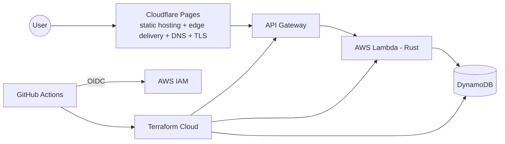
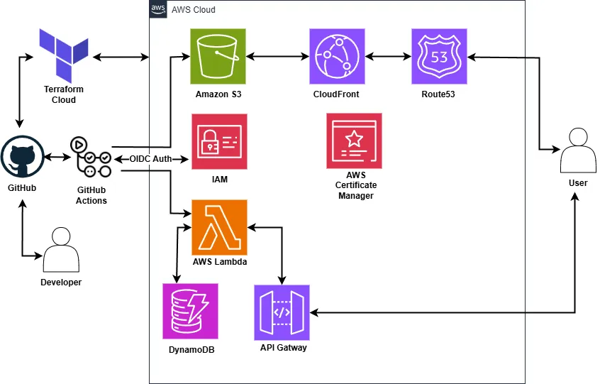

# Cloud Resume Challenge Rust (Backend)

Backend API and infrastructure for the Cloud Resume Challenge written in Rust and deployed to AWS Lambda. It increments and returns a visitor counter stored in DynamoDB.

For frontend code, see the companion repository: [astro-portfolio](https://github.com/iain-kirkham/astro-portfolio).

## Key features

- **Real-time visitor counter:** Each visit triggers a backend update so the counter reflects current traffic in near-real-time.
- **Fast, scalable API:** The backend runs on AWS Lambda (serverless), so it scales automatically without managing servers.
- **Consistent user experience:** API Gateway routes requests reliably, while CORS handling supports browser-based frontend calls.
- **Data persistence:** Visitor totals are stored in DynamoDB, a managed NoSQL database built for high availability.
- **Repeatable cloud setup:** Terraform defines infrastructure as code, making environments reproducible and easier to maintain.
- **Automated quality checks:** GitHub Actions runs linting, tests, and deployment to reduce manual release risk.

### Why this matters for a portfolio

This project demonstrates more than just writing code. It shows an end-to-end delivery workflow: designing an API, storing live data, automating deployment, and operating cloud infrastructure using modern DevOps practices.

## Architecture

The frontend is hosted on Cloudflare Pages, which serves the static site, handles edge delivery, manages DNS for the custom domain, and provisions/renews TLS certificates automatically. The frontend calls API Gateway, which invokes the Rust Lambda. The Lambda updates and reads the visitor count in DynamoDB.

Backend infrastructure is defined with Terraform (the repo includes a Terraform Cloud workspace configuration). A push to the repository triggers GitHub Actions (authenticating to AWS via OIDC, no long-lived credentials) that build and test the code and deploy the Lambda; Terraform (or Terraform Cloud) provisions and manages backend cloud resources such as IAM roles, the Lambda function, API Gateway, and the DynamoDB table.


```mermaid
flowchart LR
    User((User)) --> CFP[Cloudflare Pages<br/>static hosting + edge delivery + DNS + TLS]
    CFP --> APIGW[API Gateway]
    APIGW --> Lambda[AWS Lambda - Rust]
    Lambda --> DDB[(DynamoDB)]

    GHA[GitHub Actions] -- OIDC --> IAM[AWS IAM]
    GHA --> TFC[Terraform Cloud]
    TFC --> Lambda
    TFC --> APIGW
    TFC --> DDB
```

### Legacy architecture (portfolio reference)

The project originally hosted the frontend on AWS, before migrating to Cloudflare Pages. This earlier architecture is kept here as a portfolio reference.

The frontend (S3 + CloudFront) called API Gateway, which invoked the Rust Lambda. The Lambda updated and read the visitor count in DynamoDB.

Infrastructure for both frontend and backend was defined with Terraform (the repo includes a Terraform Cloud workspace configuration). In a typical workflow a push to the repository triggered CI actions that built and tested the code and deployed the Lambda; Terraform (or Terraform Cloud) was used to provision and manage cloud resources such as the S3 bucket, CloudFront distribution, DNS (Route53) and DynamoDB table.

This project also used DNS and TLS services so the site could be reached securely via a custom domain (see the `terraform/legacy/frontend` module): Route53 for DNS records and ACM for TLS certificates.



> **Note:** The `terraform/legacy/frontend` module still exists in this repo, but the AWS resources it describes (S3, CloudFront, Route53, ACM) are no longer deployed — the frontend now runs on Cloudflare Pages, provisioned outside Terraform. It has been moved out of the root Terraform config so it is no longer applied, and is retained here purely as a portfolio reference.

## API usage (example)

Replace `<API_URL>` with your API Gateway URL.

```bash
# increment and fetch visitors (POST request)
curl -i -X POST "<API_URL>" \
  -H "Content-Type: application/json"
```

Expected JSON response:

```json
{ "visitors": 123 }
```

The function expects a `POST` to increment the counter. `OPTIONS` requests are handled for CORS preflight (204), and other methods return 405.

## Testing with Bruno / Postman

You can use Bruno or Postman to exercise the API (both can import curl commands). Quick steps:

- Open Bruno or Postman and choose "Create Request" (or Import).
- Set the method to `POST` and the URL to your backend invoke URL (replace `<API_URL>`).
- Add header: `Content-Type: application/json`.
- Leave the body empty (this endpoint doesn't require a JSON payload) and send the request.
- Inspect the JSON response and the status code (200 on success).

Tip: both apps support importing a curl command. Copy this curl command and use the Import → Raw text feature to create the request automatically:

```bash
curl -i -X POST "<API_URL>" -H "Content-Type: application/json"
```

Save the request in a collection for repeatable testing. You can also run the collection runner to perform repeated calls when demonstrating the counter increment.

## AWS services used

This project provisions and uses the following AWS services (each is represented in the Terraform `backend` module):

- Amazon API Gateway (HTTP API) — Public HTTP endpoint that routes requests to Lambda.
- AWS Lambda — Runs the Rust backend function (serverless compute).
- Amazon DynamoDB — Stores the visitor counter (managed NoSQL database).
- AWS Identity and Access Management (IAM) — Roles and policies used by Lambda and GitHub Actions to secure access.
- IAM OIDC provider (GitHub Actions) — GitHub's OIDC provider allows Actions to assume AWS roles without long-lived credentials (declared in Terraform).
- Amazon CloudWatch Logs & Metrics — Stores Lambda execution logs and (optionally) custom metrics and alarms for observability.

Infrastructure is managed with Terraform and deployments are automated with GitHub Actions. The CI role and IAM bindings are declared in the backend module so GitHub Actions can deploy safely.

### Legacy AWS services (no longer deployed)

The following services were used for frontend hosting before the migration to Cloudflare Pages. Their Terraform definitions still exist in `terraform/legacy/frontend`, but the actual resources are no longer deployed on AWS and the module is excluded from the root Terraform config — it is kept for portfolio reference only.

- Amazon S3 — Hosted the frontend static site content.
- S3 Bucket Policy — Controlled access to objects in the S3 bucket (used with CloudFront OAC).
- Amazon CloudFront — CDN in front of the S3 site for low-latency global delivery and caching.
- CloudFront Origin Access Control (OAC) — Securely granted CloudFront permission to read objects from the S3 origin.
- AWS Certificate Manager (ACM) — Provided TLS certificates that CloudFront used to serve content over HTTPS.
- Amazon Route 53 — DNS hosting for the custom domain (alias records pointed to CloudFront).

## Other tools

- **Terraform** — Used to define and provision cloud infrastructure.
- **Terraform Cloud (workspaces)** — This project is configured to use a Terraform Cloud workspace for state and runs (see `terraform/main.tf`).
- **GitHub Actions** — CI/CD platform used to lint, test and deploy the Lambda.
- **cargo-lambda** — Utility for building and deploying Rust Lambda functions.
- **MSYS2** — Used on Windows hosts to provide libraries necessary for ARM64 cross-compilation.

## Configuration

The Lambda reads the DynamoDB table name from an environment variable set in Terraform (`TABLE_NAME`). If you want to run the function locally or change environments, consider loading configuration from environment variables or a small config file so the same code works across local, test and production environments.

## Tech stack

- **Rust:** A performant, memory-safe systems language used here to build a reliable backend service.
- **`lambda_http` + `tokio` + AWS SDK for Rust:** Core libraries that handle HTTP requests, async execution, and AWS service integration.
- **AWS Lambda (ARM64, `provided.al2023`):** Runs the backend as serverless functions, which helps keep cost low at small traffic levels while scaling automatically.
- **API Gateway HTTP API:** Public entry point that securely forwards web requests to Lambda.
- **DynamoDB:** Managed NoSQL data store for the visitor counter, chosen for simplicity and low operational overhead.
- **Terraform:** Infrastructure as code tooling used to provision backend AWS resources consistently. The `frontend` module still exists in the repo but its resources (S3, CloudFront, Route53, ACM) are no longer deployed — see [Legacy AWS services](#legacy-aws-services-no-longer-deployed).
- **GitHub Actions:** CI/CD pipeline that checks code quality and deploys changes on pushes to `master`.

## Prerequisites

- [Rust](https://www.rust-lang.org/) (1.84+)
- [Cargo Lambda](https://www.cargo-lambda.info/) for Lambda build/deploy
- [AWS CLI](https://aws.amazon.com/cli/) configured with appropriate permissions
- [Terraform](https://www.terraform.io/) for infrastructure provisioning
- [MSYS2](https://www.msys2.org/) on Windows for ARM64 cross-compilation support (ensure MSYS2 `bin` is in `PATH`)

## Project structure

```text
.
├── src/
│   ├── main.rs                  # Lambda entry point and request handling
│   ├── get_visitors.rs          # Read visitor count from DynamoDB
│   ├── update_visitors.rs       # Increment visitor count in DynamoDB
│   ├── utils.rs                 # CORS and HTTP method helpers
│   └── lib.rs
├── tests/
│   ├── get_visitors_integration.rs
│   └── update_visitors_integration.rs
├── terraform/
│   ├── main.tf
│   ├── variables.tf
│   ├── outputs.tf
│   └── modules/
│       ├── backend/
│       └── frontend/          # legacy, no longer deployed (see README)
└── .github/workflows/
	├── ci-and-deploy.yml
	└── security-scan.yml
```

## Local development

### 1) Build and lint

```bash
cargo fmt --all --check
cargo clippy --all-targets --all-features -- -D warnings
```

### 2) Run tests

```bash
cargo test
```

Notes:

- Integration tests use DynamoDB table `cloud-resume-challenge-test` in `eu-west-2`.
- Your AWS credentials must allow DynamoDB read/write operations for that table.

## Deployment

### Infrastructure (Terraform)

Run Terraform from the `terraform/` directory:

```bash
terraform init
terraform plan
terraform apply
```

### Lambda package and deploy

```bash
cargo lambda build --release --arm64 --output-format zip
cargo lambda deploy
```

CI/CD (`.github/workflows/ci-and-deploy.yml`) runs linting, tests, Lambda build, and deploy on pushes to `master`.

## Observability

- Application logs are emitted via `lambda_http::tracing`.
- Lambda execution logs are written to CloudWatch Logs (via IAM permissions in Terraform).
- Current logs include error context such as table name and item ID when reads fail.

Planned improvements:

- Add structured request-level fields (request ID, path, method) to log events.
- Add custom CloudWatch metrics and alarms for error rate and latency.
- Enable X-Ray active tracing for end-to-end request visibility.

## Future enhancements

- Support per-post visitor counters for better analytics.
- Add a small admin interface or simple endpoints for exporting/resetting counts so the project can demonstrate basic operational features.
